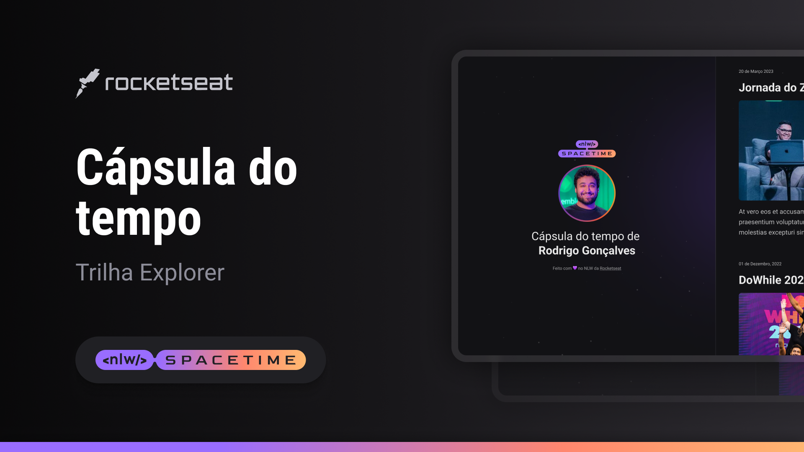

  

## Projeto 🖥
Esse é um projeto web responsivo de uma capsula no tempo.

## Tecnologias 🚀
Esse projeto foi desenvolvido durante a NLW da Rocketseat com as seguintes tecnologias:

-HTML
-CSS
-Git e Github

## Layout 📌
Você pode visualizar o layout do projeto atraves [desse link](https://www.figma.com/file/ZiMohAe7iy2wpR96r8aqOo/C%C3%A1psula-do-tempo-%E2%80%A2-Trilha-Explorer-(Community)-(Copy)?type=design&node-id=306%3A84&t=pIUzEjaOqDOeyNF9-1)
é necessario ter uma conta no [figma](https://www.figma.com.br)